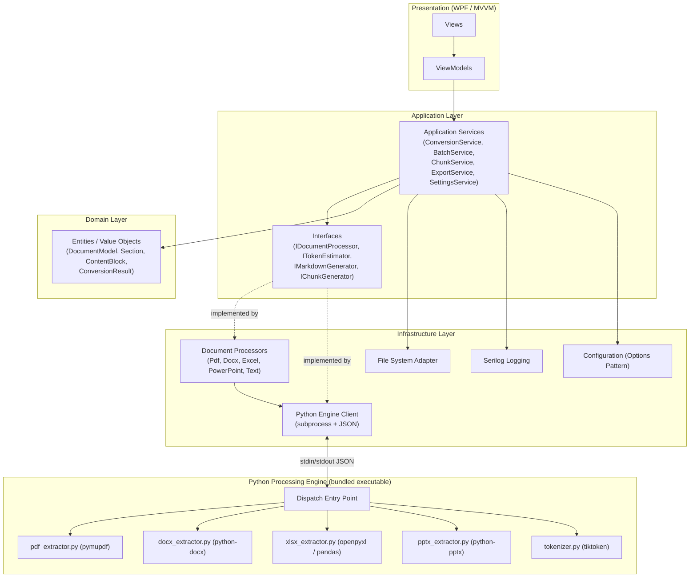
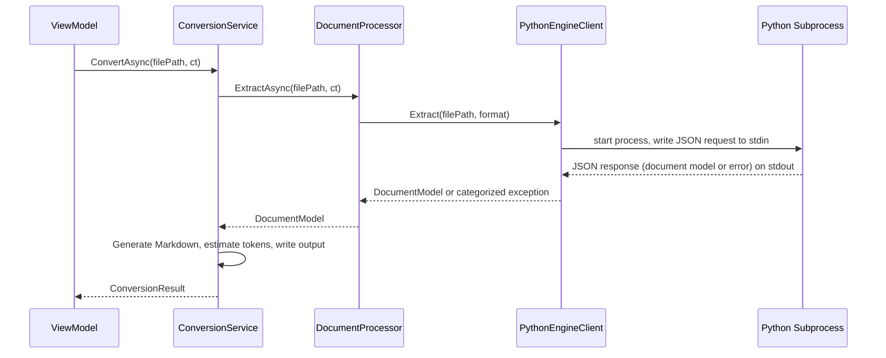
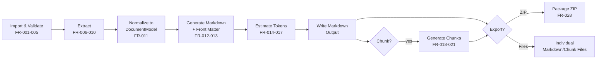
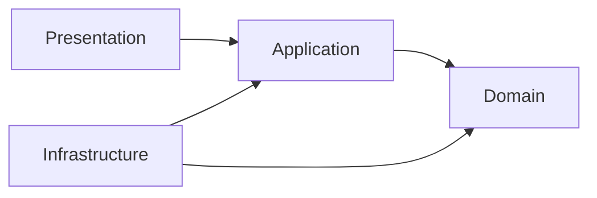

# 07 — Technical Architecture

**Project:** AI Document Converter
**Status:** Draft — Phase 7 (System Architecture) — Gate 2
**Date:** 2026-08-23

---

## 1. Overall Architecture

The application is a single-user Windows desktop app (.NET 8 / WPF) composed of four
.NET layers plus one external Python processing engine. There is no server, no
database, and no network dependency (NFR-001, NFR-002).



See ADR-001 (`docs/adr/ADR-001-python-integration.md`) for why subprocess + JSON was
selected over embedded Python, a system-installed Python, or a long-running local
server.

## 2. Component Architecture

| Component | Layer | Responsibility |
|---|---|---|
| `ConversionService` | Application | Orchestrates single-file conversion (UC-001): validate → extract → normalize → generate Markdown → estimate tokens → write output. |
| `BatchService` | Application | Orchestrates batch conversion (UC-002): bounded parallelism, progress reporting, cancellation (FR-037), batch size ceiling (NFR-013). |
| `ChunkService` | Application | Splits a converted `DocumentModel` into chunk files (UC-003), structure-aware (FR-019/020). |
| `ExportService` | Application | Produces individual Markdown files or a batch ZIP package (UC-004). |
| `SettingsService` | Application | Reads/writes/validates persisted configuration (UC-005), including SEC-005 Python-path validation. |
| `IDocumentProcessor` implementations | Infrastructure | One per format; see ADR-002. |
| `IPythonEngineClient` | Infrastructure | Starts the bundled Python subprocess, writes the JSON request, enforces a timeout, reads the JSON response, maps failures to FR-029 categories, supports cancellation (kills the process). |
| `ITokenEstimator` | Infrastructure (Python-backed) | Computes the two token estimates per ADR-003. |
| `IMarkdownGenerator` | Application/Domain | Converts a `DocumentModel` into Markdown text with YAML front matter (FR-012/013). |
| `IChunkGenerator` | Application/Domain | Implements the table-safe, heading-aware chunking algorithm (FR-019/020). |
| Serilog sinks | Infrastructure | File-based logging per FR-034/035, NFR-006. |

## 3. .NET / Python Communication (ADR-001)

Sequence for a single file (UC-001, steps 5–8):



- **Request payload:** `{ "operation": "extract", "filePath": "...", "format": "pdf" }`
- **Response payload (success):** the normalized document model as JSON (see
  `docs/09-DATA-MODEL.md`).
- **Response payload (failure):** `{ "error": { "category": "CorruptedDocument",
  "message": "..." } }`, where `category` maps 1:1 to the FR-029 error categories.
- **Cancellation (FR-037):** `PythonEngineClient` kills the child process on
  cancellation-token trigger; there is no partial-result contract to unwind because
  each subprocess handles exactly one file.
- **Timeout:** a configurable per-file timeout (Settings, FR-032) protects against a
  hung subprocess; on timeout the file is reported as a `ConversionFailure` (FR-029)
  and can be retried (FR-030).

## 4. Data Flow



## 5. Dependency Flow

Standard Clean/Layered dependency rule: Presentation depends on Application;
Application depends on Domain and on Application-defined interfaces; Infrastructure
implements those interfaces and depends on Domain, never the other way around.
Dependency Injection (`Microsoft.Extensions.DependencyInjection`) wires concrete
Infrastructure implementations to Application interfaces at startup — no layer
constructs its own dependencies.



## 6. Error Flow

Every error surfaces through the same path so the UI has one place to render
user-friendly messages (FR-029/031):

```mermaid
flowchart TB
    X[Exception anywhere in pipeline] --> Y[Mapped to one of the\nFR-029 error categories]
    Y --> Z[Logged via Serilog\n(technical detail, no document content)\nFR-034/035]
    Y --> W[Surfaced to UI as a\nuser-friendly message\nFR-029/031]
    W --> V{Retryable?}
    V -->|yes| U[Retry option shown\nFR-030]
    V -->|no| T[Terminal failure state\nfor this file only\nBR-006]
```

## 7. Logging Architecture

- Serilog, file sink under the configured log directory (FR-032), rolling daily.
- Log levels per CLAUDE.md Section 9: Information (lifecycle events), Warning
  (recoverable issues, e.g., XLSX summarization triggered), Error (categorized
  failures), Debug (verbose, opt-in via configuration).
- Structured logging (Serilog's message templates) captures file name, format, error
  category, and duration — never raw document text (NFR-006, FR-035).

## 8. Configuration

- `Microsoft.Extensions.Configuration` + Options Pattern, backed by a local JSON
  settings file (e.g., `%LOCALAPPDATA%\AIDocumentConverter\settings.json`).
- Settings covered: output directory, chunk size/overlap, Python executable path,
  log directory, max parallelism, max batch size, tokenizer display providers
  (FR-032).
- All path-type settings pass through the same validation used by SEC-002/SEC-005
  before being persisted.

## 9. Security Considerations

- No outbound network calls anywhere in the pipeline (NFR-001/002) — enforced by
  code-review checklist and verified by network-monitoring during QA (US-023).
- No telemetry/analytics/crash-reporting SDK is included (NFR-012).
- File path validation and path-traversal prevention (SEC-002) applied to every
  user-supplied path: import files, output directory, export path, Python
  executable path.
- Python executable path validated before invocation (SEC-005): the configured path
  must exist, be executable, and (for the bundled default) match the expected
  bundled binary; an externally overridden path is checked for basic sanity but
  cannot be fully verified as non-malicious — this residual risk is accepted for
  IT-configured environments and documented in `docs/18-RISK-ASSESSMENT.md`
  (Phase 07 follow-on, to be produced alongside the Sprint Plan).
- JSON request payloads never place user-supplied strings into a shell command line
  (SEC-006) — the Python subprocess is started via direct process creation with an
  argument array (or with the request delivered entirely over stdin), never through
  a shell interpreter.

## 10. Performance Considerations

- Bounded parallelism (NFR-011) for batch processing, using `SemaphoreSlim` to cap
  concurrent Python subprocesses at a configurable maximum (default: a value derived
  from processor core count, exposed in Settings).
- Large single files (up to 100 MB, NFR-003) are processed entirely inside the
  Python subprocess; the .NET side only streams the JSON request/response, keeping
  its own memory footprint low.
- The proposed benchmark matrix in `docs/03-SRS.md` Section 8 is the acceptance bar
  for `docs/16-TEST-STRATEGY.md` performance testing.

## 11. Related ADRs

- `docs/adr/ADR-001-python-integration.md`
- `docs/adr/ADR-002-document-processing-architecture.md`
- `docs/adr/ADR-003-token-estimation-strategy.md`

---

*Next document: `docs/08-APPLICATION-ARCHITECTURE.md`*
