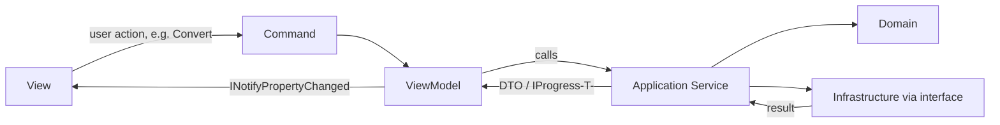

# 08 — Application Architecture

**Project:** AI Document Converter
**Status:** Draft — Phase 8 (Application Architecture) — Gate 2
**Date:** 2026-08-23

---

## 1. Chosen Structure

Presentation → Application → Domain, with Infrastructure implementing
Application-defined interfaces, plus a standalone Python Engine invoked from
Infrastructure. This is the structure CLAUDE.md Section 8/23 recommends, kept
practical for a desktop app — no separate "API" layer, no CQRS/mediator pipeline,
no generic repository layer, since there is no database (see `docs/09-DATA-MODEL.md`).

## 2. Why This Architecture

- **Testability without a database or web host:** Application services can be unit
  tested by mocking the Infrastructure interfaces (`IDocumentProcessor`,
  `IPythonEngineClient`, `ITokenEstimator`), with no in-memory database or web
  server needed — appropriate for `docs/16-TEST-STRATEGY.md`'s xUnit approach.
- **Mid-level-developer friendly (CLAUDE.md Section 5):** four layers, one direction
  of dependency, no reflection-based wiring beyond standard
  `Microsoft.Extensions.DependencyInjection` registration in `App.xaml.cs`.
- **MVVM keeps Views logic-free (CLAUDE.md Section 50):** ViewModels call Application
  services and expose observable state; Views bind to ViewModels only.
- **Matches the SRS's separation of concerns (NFR-007)** without introducing
  patterns the project doesn't need (no Factory beyond the simple `IDocumentProcessor`
  "first match" resolution in ADR-002; no Adapter beyond the one genuinely needed
  for the Python boundary).

## 3. Layer Contents

### Presentation (`AI.Document.Converter.Wpf`)
- **Views:** Dashboard, Conversion Screen, Conversion Result, Chunk Settings,
  Settings (per CLAUDE.md Section 49).
- **ViewModels:** one per View (`DashboardViewModel`, `ConversionViewModel`,
  `ChunkSettingsViewModel`, `SettingsViewModel`), implementing `INotifyPropertyChanged`.
- **Commands:** `RelayCommand`/`AsyncRelayCommand` wrapping Application service calls
  (Import, Convert, ConvertAll, Cancel, GenerateChunks, Export, Retry).
- **Converters:** WPF `IValueConverter` implementations for UI-only formatting
  (e.g., bytes → "2.3 MB", enum status → icon/color).
- **Resources:** styles, templates, shared brushes/fonts for the enterprise look
  and feel (CLAUDE.md Section 49/60).

### Application (`AI.Document.Converter.Application`)
- **Interfaces:** `IDocumentProcessor`, `IPythonEngineClient`, `ITokenEstimator`,
  `IMarkdownGenerator`, `IChunkGenerator`, `ISettingsStore`.
- **Services:** `ConversionService`, `BatchService`, `ChunkService`,
  `ExportService`, `SettingsService` (see `docs/07-TECHNICAL-ARCHITECTURE.md`
  Section 2 for responsibilities).
- **Models:** DTOs crossing the Presentation boundary (`ConversionResultDto`,
  `BatchProgressDto`, `FileImportItemDto`) — kept distinct from Domain entities so
  UI-shape concerns never leak into Domain.
- **DTOs:** request/response shapes for the Python JSON contract
  (`ExtractRequestDto`, `ExtractResponseDto`), owned here since they are an
  Application-level integration concern, not a Domain concept.

### Domain (`AI.Document.Converter.Domain`)
- **Entities/Value Objects:** `DocumentModel`, `DocumentMetadata`, `Section`,
  `ContentBlock` (and its variants), `ConversionResult`, `TokenEstimate`,
  `ChunkDefinition` (full shapes in `docs/09-DATA-MODEL.md`).
- **Enums:** `SupportedFileType`, `ErrorCategory` (mirroring FR-029), `ContentBlockType`,
  `ExtractionMethod` (native / placeholder-no-text / future-OCR, per the SRS's
  OCR-extensibility note).
- No behavior beyond simple invariants (e.g., a `ChunkDefinition` cannot have a
  negative overlap) — this layer stays a plain data model, appropriate for a
  document-conversion tool with no complex business workflow state machine.

### Infrastructure (`AI.Document.Converter.Infrastructure`)
- **DocumentProcessing/Pdf, /Docx, /Excel, /PowerPoint, /Text:** one
  `IDocumentProcessor` implementation per format (ADR-002).
- **Python:** `PythonEngineClient` (ADR-001), request/response JSON
  (de)serialization, process lifecycle, timeout, cancellation.
- **FileSystem:** path validation (SEC-002), safe read/write helpers, temp-file
  management with startup cleanup (SEC-004).
- **Logging:** Serilog configuration and sink setup.
- **Configuration:** Options-pattern classes bound to the persisted JSON settings
  file, plus the SEC-005 Python-path validator.

### Python Engine (`AI.Document.Converter.Python`)
- Not a .NET project — a Python source tree built into the bundled executable
  (ADR-001). Contains one extractor module per format plus the tokenizer module
  (ADR-003) and a single JSON dispatch entry point. Owned and versioned alongside
  the .NET solution but built with its own toolchain (PyInstaller).

## 4. MVVM Data Flow (illustrative)



## 5. Illustrative Interface Shapes

These are conceptual, for architecture review only — final member signatures are
refined during implementation (CLAUDE.md Section 26).

```csharp
public interface IDocumentProcessor
{
    bool CanProcess(string filePath);

    Task<DocumentModel> ExtractAsync(
        string filePath,
        CancellationToken cancellationToken);
}

public interface ITokenEstimator
{
    Task<TokenEstimate> EstimateAsync(
        string markdown,
        CancellationToken cancellationToken);
}

public interface IChunkGenerator
{
    IReadOnlyList<DocumentChunk> GenerateChunks(
        DocumentModel document,
        ChunkOptions options);
}
```

## 6. Cross-Cutting Concerns

- **Dependency Injection:** registered in `App.xaml.cs` via
  `Microsoft.Extensions.DependencyInjection`; ViewModels and Application services
  are registered with appropriate lifetimes (ViewModels transient/scoped per view
  instance, services singleton where stateless).
- **Async/cancellation:** every Application service method that touches
  Infrastructure accepts a `CancellationToken`; `BatchService` composes a single
  `CancellationTokenSource` per batch run, wired to the Cancel command (FR-037).
- **Progress reporting:** `IProgress<BatchProgressDto>` passed from the ViewModel
  into `BatchService`, satisfying FR-023 without the Application layer depending on
  WPF's dispatcher directly.

---

*Next document: `docs/09-DATA-MODEL.md`*
