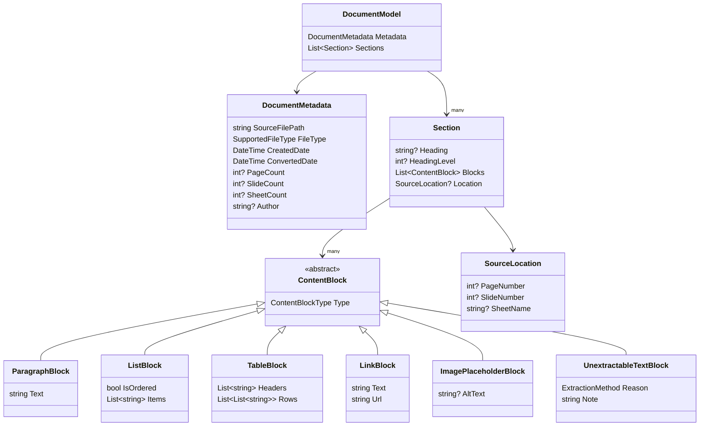
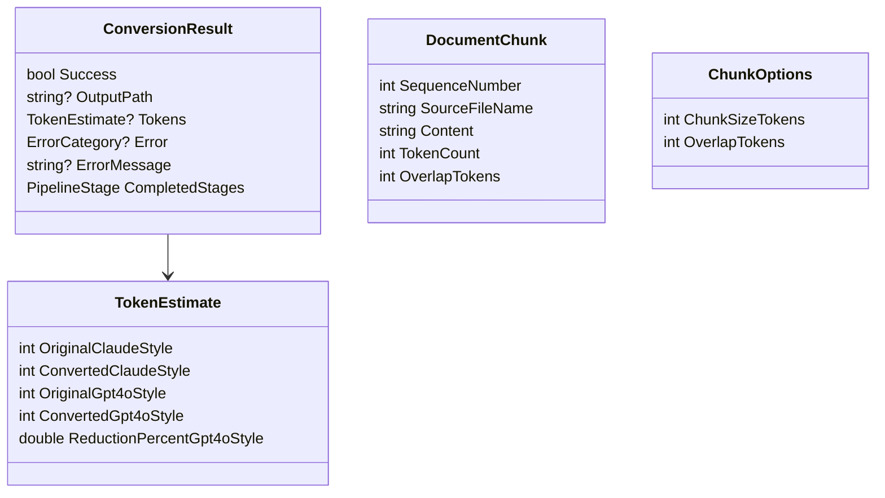

# 09 — Domain & Data Model

**Project:** AI Document Converter
**Status:** Draft — Phase 9 (Data Model) — Gate 2
**Date:** 2026-08-23

---

## 1. Is a Database Required?

**Database is not required for MVP.**

Rationale: the application is single-user, single-machine, and has no requirement for
querying, relational integrity, or multi-session shared state (`docs/01-BRD.md`
Section 7; `docs/02-PRD.md` Section 6). Persistence needs are fully met by:

- A local JSON settings file for configuration (FR-033), read/written via the
  Options pattern (`docs/08-APPLICATION-ARCHITECTURE.md` Section 3).
- The file system itself for output (Markdown, chunks, ZIP packages).
- In-memory state for the current session's import list, batch progress, and
  results — discarded on application close, since no conversion-history/audit
  database is in scope for MVP (`docs/02-PRD.md` Section 6).

If a future phase requires conversion history, audit trail, or cross-session search,
that decision will be revisited with its own ADR rather than retrofitted silently
(CLAUDE.md Section 52).

## 2. Normalized Document Model

Every extracted document — regardless of source format — is mapped into this common
model before Markdown generation (FR-011). This is the contract returned by
`IDocumentProcessor.ExtractAsync` and by the Python subprocess's JSON response
(ADR-001).



### Field notes

- `DocumentMetadata` maps directly to the front-matter fields required by FR-013
  (`source`, `file_type`, `created_date`, `converted_date`, `pages`, `author`).
  `Author` is nullable — for formats/files with no author metadata (e.g., TXT), the
  front-matter field is **omitted entirely** rather than written as an empty string,
  keeping downstream RAG parsing consistent (resolves the minor ambiguity noted in
  the Requirements Quality Review).
- `PageCount`/`SlideCount`/`SheetCount` are all nullable on the same metadata type
  rather than three separate metadata classes — simpler for a mid-level developer
  than a per-format metadata hierarchy, at the cost of two always-null fields per
  document. Acceptable trade-off given the model's small size.
- `ImagePlaceholderBlock` backs FR-039 — an embedded image becomes this block type,
  rendered as a placeholder marker in Markdown, never the image itself.
- `UnextractableTextBlock` backs FR-043 — a PDF page (or, in principle, any other
  source) with no extractable text becomes this block type instead of being
  silently dropped.
- `SourceLocation` backs the page/slide/sheet reference preservation required by
  FR-012.

## 3. OCR Extensibility Reservation

Per the Requirements Quality Review (SRS Section 9), the model reserves an explicit
extensibility point now so that adding OCR in Phase 2 (`docs/20-FUTURE-ROADMAP.md`)
does not require a breaking change:

- `ExtractionMethod` is an enum: `NativeText`, `PlaceholderNoText` (current use, via
  `UnextractableTextBlock`), and `OcrText` (reserved, unused until Phase 2).
- When OCR is introduced, a page currently represented as `UnextractableTextBlock`
  with `ExtractionMethod.PlaceholderNoText` can be replaced by a normal
  `ParagraphBlock` (or similar) carrying `ExtractionMethod.OcrText`, without
  changing the shape of `DocumentModel`, `Section`, or any other block type.

## 4. Conversion Result & Chunking Models



- `PipelineStage` is a `[Flags]` enum (`Converted`, `Chunked`, `Exported`)
  implementing FR-045's per-stage success tracking: a batch item is a full "success"
  only when `CompletedStages` includes every stage the user requested for that run.
- `TokenEstimate` carries both tokenizer profiles per ADR-003; the UI is
  responsible for labeling each clearly as an estimate (FR-017).

## 5. Settings Model (persisted JSON, not a database)

```json
{
  "outputDirectory": "string",
  "chunkSizeTokens": 512,
  "chunkOverlapTokens": 50,
  "pythonExecutablePath": "string",
  "logDirectory": "string",
  "maxParallelism": 4,
  "maxBatchFiles": 500,
  "maxBatchSizeBytes": 5368709120,
  "tokenizerDisplayProviders": ["ClaudeStyle", "Gpt4oStyle"]
}
```

Defaults match the values fixed in `docs/03-SRS.md` (FR-018, NFR-013).

---

*Next document: `docs/10-FOLDER-STRUCTURE.md`*
