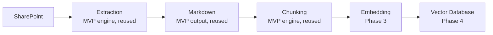

# 20 — Future Roadmap

**Project:** AI Document Converter
**Status:** Draft — Phase 20 (Future Roadmap)
**Date:** 2026-08-23

---

This formalizes and extends `docs/02-PRD.md` Sections 7–8 into the phase structure
CLAUDE.md Section 37 specifies. None of this is in scope for v1.0.0 (MVP) — it exists
so MVP architecture decisions don't foreclose it unnecessarily (see the "Enabled by
MVP architecture" column).

## Phase 2 — OCR & Broader Format Support

| Item | Description | Enabled by MVP architecture |
|---|---|---|
| OCR for scanned PDFs/images | Tesseract OCR integration in the Python engine | `ExtractionMethod.OcrText` is already reserved in `docs/09-DATA-MODEL.md` Section 3; a scanned page currently marked `UnextractableTextBlock` (FR-043) becomes a normal text block tagged `OcrText` — no `DocumentModel` shape change needed |
| Additional input formats: HTML, CSV | New `IDocumentProcessor` implementations | ADR-002's Strategy pattern adds a new processor with no change to orchestration code |
| Recursive (subfolder) folder import | Scan subfolders, not just the top level | FR-004 is written narrowly on purpose; lifting the restriction is a contained change to `ImportService` |
| Table-extraction fidelity improvements | Address R-07/R-08 (`docs/18-RISK-ASSESSMENT.md`) based on real user feedback | Feedback loop depends on `docs/22-BUG-TRACKER.md` usage post-release |
| Non-English/multilingual support | Revisit only if a confirmed business need emerges (explicitly not planned per the 2026-08-23 English-only decision) | Would require a tokenizer-strategy revisit (ADR-003) and extraction-quality validation per language |

## Phase 3 — Vector/Embedding Preparation

| Item | Description |
|---|---|
| Embedding generation | Generate vector embeddings from chunk files (`docs/09-DATA-MODEL.md` `DocumentChunk`), likely via a local embedding model to preserve the offline guarantee, or an explicitly-opt-in cloud provider call clearly separated from the offline MVP core |
| Azure OpenAI integration | Only as an explicit, separately-approved capability — must not silently compromise NFR-001/002; would need its own BRD-style justification and security review given the banking context |
| JSON / structured chunk-metadata output | Additional output format alongside Markdown, reusing the existing `DocumentModel`/`DocumentChunk` shapes |

## Phase 4 — Knowledge Base Integration

| Item | Description |
|---|---|
| Azure AI Search integration | Push generated chunks/embeddings into a managed vector index |
| Plugin architecture for multiple AI providers | Generalizes ADR-003's per-provider tokenizer approach into a registered-provider model |

## Phase 5 — Enterprise RAG Pipeline

The MVP's extraction → Markdown → chunking core is designed to be the reused engine
at the center of this pipeline; SharePoint ingestion and vector-database publishing
are the only genuinely new components required at this stage, per the layered
architecture in `docs/07-TECHNICAL-ARCHITECTURE.md`.

## Explicitly Not Committed To Any Phase

Also considered per CLAUDE.md Section 37, listed here without a target phase since
demand is unconfirmed: image processing/description (beyond the MVP's placeholder),
additional export formats beyond JSON, and a conversion-history/audit database (see
`docs/09-DATA-MODEL.md` Section 1 — revisit only with its own ADR).

---

*Next document: `docs/21-REQUIREMENT-TRACEABILITY.md`*
